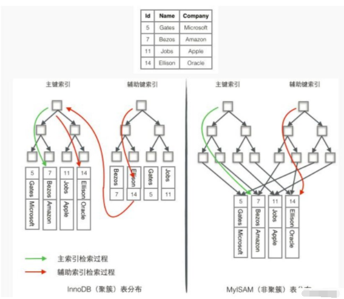

# 秋招收集

## 自我介绍

#### 重要性

##### 第一印象

自我介绍是塑造第一印象的重要部分
甚至有人说面试官在前三十秒就已经决定要不要这位应聘者了
剩下的几十分钟都是在验证自己前三十秒的结论

##### 暖场

我们可以用这个过程缓解紧张
面试官也会用这个过程整理信息,设计思路
不是每个面试官都会提前研读简历,思考面试计划

##### 主动权

自我介绍是面试过程中面试者第一次有机会掌握话语主动权的机会
虽然结束时还有一次,但是远没有第一次重要
我们有足够的灵活度和决定权选择想表达的内容,追求想要的效果,把自己的与众不同展示出来
过了这30秒,后续主动权就都是面试官的了,哭
在这个环节尽量做一些铺垫,引发面试官好奇,主动引导接下来的问答,延续自我介绍中的某些话题,减少不确定性

#### 面试官对自我介绍的期待

1 经历概括 这里提到的项目角色和岗位 面试官接下来会重点考察

2 经验和技能总结

  简单评价应聘者的经验面和技能等级,同样对重点提及的经验和技能后续会重点考察

3 表达风格和气场

  面试官知道自己介绍基本都是提前准备好的,体现不了临场语言组织能力.但是可以看出应聘者的表达风格 激情? 平静? 小心谨慎? 也可以感受到应聘者的气场 张扬自信谦逊或是自卑

4 简历之外的内容 

  职业规划、跳槽动机、其它亮点等.这部分的发挥往往会有意想不到的效果

#### 雷区

1 简单重复简历

2 自己主观自评

3 口号化的假大空语言变表达向往

4 项目和技术细节

5 与个人经历不相关信息

#### 目标效果

1 满足面试官对信息的期待

2 产生好感

3 记住我

##### 满足面试官对信息的期待

这是自我介绍的基本要求,把个人信息,主要经历,经验和技能有条理地组织起来,有逻辑的讲出来

根据面试场合要做不同版本切换,公司里的面试3-5分钟即可

##### 产生好感

首先态度诚恳,内容不要夸大捏造.说清楚项目成果中,什么是你做的,什么是助攻的,不要闪烁其词.

另外要有友好互动,发言的每句话都可能引起面试官的反馈,要善于捕捉这些反馈,及时调整自己表达的内容

###### 控制详略

比如面试官略微侧头,仔细听时很可能是产生了兴趣,此时应该多讲相关内容,帮助面试官理解得更充分一些

如果面试官连续点头,口称"好的,好的",就是在催促你说下一个话题

###### 扭转局面

一旦发现面试官有怀疑或反对的迹象,不要慌,想想是什么引起怀疑或反感,及时补充信息,把坏事变成好事,但是不要变成辩解

##### 记住自己

通过总结工作经历,挖掘个人亮点.自我介绍的时候完全可以加一两个亮点进去.
这些亮点要有细节,细节可以让自我介绍更生动,让人信服,令人印象深刻

可以是精炼的数据或例证

升华的感受或评价

转折或波澜

别把铺垫弄巧成拙,自己坑自己,要明确什么才是面试官认可的,不要产生误会

#### 面试自我介绍(草稿)

您好,我叫xxx来自xxx大学的信息安全专业。目前有两段实习经历,2019年7月大二到2020年7月大三在知道创于做后端和数据平台开发，2020年9月至今在启明星辰做安全渗透测试.

第一次辞职是因为知道创于未来要把研发迁到天津,未来转正只能在天津，所以辞职了。然后大四学校规定9-12月必须找安全技术方面的实习，要不然不给学分毕业，所以就先去了启明星辰进行渗透测试实习

我自己比较擅长Go和Python

在知道创于用Go基于Gin和grpc写过一个标准流量代理工具，Python主要使用过爬虫,后端，ETL开发等工作

在启明星辰最近就属于安全测试，对系统进行渗透攻击,准备12月10号到学校规定时间辞职目前打算


## 项目介绍

## 计算机网络

1 https过程

2 TCP 为什么要三次握手和四次挥手

3 如何确认发出去的消息没有收到(超时重传)这个时间如何设定的

4 三次握手可以改成四次握手么

5 TCP/IP协议栈

6 数据链路层是干什么的,有什么协议

7 MTU有什么作用,超过这个的话包会怎么处理,分片是在链路层吗,分片后的IP包怎么保证顺序到达,有什么机制保证顺序和完整性

8 https为什么要非对称加密

9 我们现在视频语音用的什么协议,为什么,丢包怎么处理,为什么TCP不合适,如果网络延迟大用TCP造成什么现象,UDP容易丢包那为什么我们语音或者视频大部分情况还是很流畅,在允许一定程度的丢包的前提下我们会怎样,我们允许这种程度的丢包吗

10 网络5层体系结构

```
5 应用层 dns ftp http pop3 smtp 
		ssh telnet dhcp(动态主机配置协议)
4 传输层 TCP UDP
3 网络层 ip arp rarp icmp icmpv6 
		rip(跳最少) ospf(代价最低) bgp(比较好)
2 数据链路层 arq ppp
1 物理层
```

11 TCP通信过程,3次握手,4次挥手

三次握手

客户端 SYN = 1 seq = x

服务器 SYN = 1 ACK = 1 seq = y ack = x + 1

客户端 ACK = 1 seq = x + 1 ack = y + 1

四次挥手

客户端 FIN = 1 seq = u

服务器 ACK = 1 seq = v ack = u + 1

服务器 FIN = 1 ACK = 1 seq = w ack = u + 1

客户端 ACK = 1 seq = u + 1 ack = w + 1

12 HTTP和TCP的不同

13 拥塞控制

14 http的长连接短连接，长连接有没有什么问题？怎么解决。

15 那么我第一次可不可以syn不发送，可以不要么，可以写死么，我不发送syn行不行，为什么

16 第二次握手，服务器不发送syn呢，

17 第三次握手，[客户端](https://www.nowcoder.com/jump/super-jump/word?word=客户端)不返回ack呢，

18 针对第一次，同一个[客户端](https://www.nowcoder.com/jump/super-jump/word?word=客户端)频繁发送syn会有什么后果，怎么解决？

19 针对syn攻击，怎么解决？syncookie syn就绪队列 半连接

这里提供一个博客，讲的还是比较细致的，https://zhuanlan.zhihu.com/p/199284611，基本上就是考察的tcp每一步干什么，为什么？

## 操作系统

1 线程和进程的区别

2 线程之间变量能否互相访问

3 线程是否能访问进程变量

4 磁盘IO过程

5 线程安全

6 进程、线程、协程关系

进程

进程是进行系统资源分配和调度的最小单位.有独立的内存空间。一个进程至少包含一个主线程，也可以有更多的子线程

 top指令可以用来查看进程

线程

线程 进程进程都要在OS中注册,才可以接受OS的调度,充分利用多CPU

但是进程一旦退出，申请的各种资源都会被OS强制回收；但线程依附于进程，资源不绑定

并且OS吸取过去的教训，把线程也做成了抢夺式多任务

但是线程的抢夺式思路有一些问题.OS中不同进程水平各异，因此有一个统一标准剥夺执行权是很必要的；但同进程的一组线程必然来自同一个团队，水平相似，因此不需要对抗恶意行为，此时抢夺式的好处就没那么重要了,反而抢夺造成的执行时序紊乱问题越发突出，让大家不得不使用共享数据时加锁，确保不会搞砸

此时协作式多任务之间执行权交接点明确，就很妙

ps -T -p <pid>   查看线程操作

协程

协程这个概念的提出就可以使程序逻辑更加清晰，执行更加可控

协程实质是一种在用户空间实现的协作式多线程架构，协程不能让OS知道自己的存在,无法利用多核多线程支持

在协程每次执行中，具体执行顺序或许千变万化，但协程执行权切换只发生在用户明确放弃执行权后(比如执行yield)

协程是一种比线程更加轻量级的存在。一个线程可以拥有多个协程

从编程角度来看，协程就是控制流的主动让出(yirld)和恢复(resume)机制

除非确信现在的共享数据不怕被其他协程查看，否则不要在共享数据修改完成前随便放弃自己的执行权

当然，多数情况下，使用协程是为了满足“开个小差做点别的”的同时，不希望阻塞主要执行绪。这种简单应用场景多半也没有什么数据需要共享

7 进程、线程共享内存

8 并发锁

9 进程间如何通信

10 死锁的形成条件

11 cpu调度算法

12 线程的状态

13 系统调用的实现

14 操作系统内存管理的方式有哪些

15 进程切换，保存的信息在哪

16 僵尸进程，孤儿进程

17 linux查看进程cpu 内存命令，top命令下的cpu组，我们通过哪些哪些参数来具体了解cpu的详情，监控系统内存情况命令，在这些情况中，一般如何查看内存泄漏，怎么去定位，具体到线程

18 direct io和buffer io解释

19  linux下写文件先写到哪？（page cache）

20 page cache的实现机制，如何利用page cache

操作系统相关文章

https://blog.csdn.net/qq_37898073/article/details/93484358

https://www.jianshu.com/p/35eccacdce7e

https://www.jianshu.com/p/2e054397f6b7

## 计算机组成原理

https://blog.csdn.net/qq_23994787/article/details/78083223

https://www.jianshu.com/p/7b0a15b4c5ec

https://www.jianshu.com/p/f6c62b11ba3a

## 综合

https://www.jianshu.com/u/48c652e93f5a

## 密码学

1 对称与非对称加密应用场景

2 SSL加密原理

非对称加密

是非对称加密A保留秘钥，通过网络传递公钥

A先用A秘钥加密数据的hash；再用B公钥加密数据

传递给B

B收到后先用B私钥解密，在本地运算一个hash，再用A公钥解密hash

但是依旧有隐患C同时窃取AB的公钥，依然可以中间人攻击

CA

ca保证公钥真实性。B先把自己的公钥交给CA，CA用自己的私钥加密这些数据，加密以后的数据称之为B的数据证书。

B向A传递的是加密后的B的数据证书，但是A怎么保证CA证书不被劫持，C完全可以拿一个假的CA证书欺骗A

CA把自己的CA证书集成在浏览器和操作系统中，A运行浏览器或操作系统的时候已经有了CA

所以直接交换彼此数据证书就行，虽然C还是可以窃取公钥，但是C不在CA体系中，无法自己伪造一个通过CA认证的CA数字证书

除非内置CA证书被篡改，例如盗版系统，非官方浏览器，被病毒攻击等


所以，在现代，A和B之间要进行安全，省心的网络通信，需要经过以下几个步骤

- 通过CA体系交换public key
- 通过非对称加密算法，交换用于对称加密的密钥
- 通过对称加密算法，加密正常的网络通信

这基本就是SSL/TLS的工作过程了

客户端访问网页发生的申请

- 用户向web服务器发起一个安全连接的请求

- 服务器返回经过CA认证的数字证书，证书里面包含了服务器的public key

- 用户拿到数字证书，用自己浏览器内置的CA证书解密得到服务器的public key

- 用户用服务器的public key加密一个用于接下来的对称加密算法的密钥，传给web服务器

- - 因为只有服务器有private key可以解密，所以不用担心中间人拦截这个加密的密钥

- 服务器拿到这个加密的密钥，解密获取密钥，再使用对称加密算法，和用户完成接下来的网络通信

## 数据库

1 介绍数据库索引
  结构上说  哈希索引
  逻辑上说  主键索引 组合索引 前缀索引

2 聚集索引和非聚集索引的区别
  innoDB是聚集索引;MyISAM是非聚集索引
  可以在深入看看数据逻辑结构

3 索引设计

B+Tree是数据库系统实现索引的首选数据结构

关系型数据库

**MyISAM 引擎使用 B+Tree 作为索引结构,叶节点的 data 域存放的是数据记录的地址**

在 MyISAM 中,主索引和辅助索引(Secondary key)在结构上没有任何区别,只是主索引要求 key 是唯一的,而辅助索引的 key 可以重复

因此,MyISAM 中索引检索的算法为首先按照 B+Tree 搜索算法搜索索引,如果指定的 Key 存在,则取出其data 域的值,然后以 data 域的值为地址,读取相应数据记录。

**MyISAM 的索引方式也叫做“非聚集索引”**,之所以这么称呼是为了与 InnoDB的聚集索引区分

非关系型数据库

虽然 InnoDB 也使用 B+Tree 作为索引结构,但具体实现方式却与 MyISAM 截然不同。

1.**第一个重大区别是 InnoDB 的数据文件本身就是索引文件。从上文知道,MyISAM 索引文件和数据文件是分离的,索引文件仅保存数据记录的地址**。

而在InnoDB 中,表数据文件本身就是按 B+Tree 组织的一个索引结构,这棵树的叶点data 域保存了完整的数据记录。这个索引的 key 是数据表的主键,因此 **InnoDB 表数据文件本身就是主索引。**

叶节点包含了完整的数据记录。这种索引叫做聚集索引。因为 InnoDB 的数据文件本身要按主键聚集

 **.InnoDB 要求表必须有主键(MyISAM 可以没有),**如果没有显式指定,则 MySQL系统会自动选择一个可以唯一标识数据记录的列作为主键,如果不存在这种列,则MySQL 自动为 InnoDB 表生成一个隐含字段作为主键,类型为长整形

**请尽量在 InnoDB 上采用自增字段做表的主键**。因为 InnoDB 数据文件本身是一棵B+Tree,非单调的主键会造成在插入新记录时数据文件为了维持 B+Tree 的特性而频繁的分裂调整,十分低效,而使用自增字段作为主键则是一个很好的选择。**如果表使用自增主键,那么每次插入新的记录,记录就会顺序添加到当前索引节点的后续位置,当一页写满,就会自动开辟一个新的页**

2.第二个与 MyISAM 索引的不同是 InnoDB 的**辅助索引 data 域存储相应记录主键的值而不是地址**。换句话说,InnoDB 的所有辅助索引都引用主键作为 data 域。

**聚集索引这种实现方式使得按主键的搜索十分高效,但是辅助索引搜索需要检索两遍索引:首先检索辅助索引获得主键,然后用主键到主索引中检索获得记录。**

 Ps :为什么不建议使用过长的字段作为主键?

 因为所有辅助索引都引用主索引,过长的主索引会令辅助索引变得过大


4 数据库隔离级别

读未提交 - 脏读 

读已提交 - 不可重复读

可重复读 - 幻读

串行化 - 完美

读未提交没有任何防护，读不受限制，读不加锁

读已提交 - 写数据的时候加上X锁（排他锁），读数据的时候添加S锁（共享锁），而且有约定：**如果一个数据加了X锁就没法加S锁；同理如果加了S锁就没法加X锁，但是一个数据可以同时存在多个S锁（因为只是读数据），并且规定S锁读取数据，一旦读取完成就立刻释放S锁（不管后续是否还有很多其他的操作，只要是读取了S锁的数据后，就立刻释放S锁）。**

可重复读 - 对S锁进行修改，之前的S锁是：读取了数据之后就立刻释放S锁，现在修改是：在读取数据的时候加上S锁，但是要直到事务准备提交了才释放该S锁，X锁还是一致

串行化 - 事务只能一件一件进行，不能并发进行

mysql默认为可重复读

oracle仅支持两个级别，读已提交和串行化，默认是读已提交

5 临界区、互斥锁、乐观锁、悲观锁及其适用场景

6 redis为什么这么快

7 如果你要买个iphone，很多人也要买同一个iphone，商品信息存在redis，怎么保证多个用户对redis的写操作是正确的，是不会覆盖的，加锁太慢了有什么其他方式吗，听过带条件更新吗

8 死锁是怎么产生的，怎么避免？请求和保持怎么去打破（说了超时和一次性分配），那一次性分配就能全部获得吗，一个线程一次性要AB，另一个线程也要一次性AB，那分给谁？（等一个用完释放呀），一个线程占有A请求B，一个线程占有B请求A，是因为加锁顺序不对导致的，那按什么顺序加锁？（被问懵了，面试官也很绝望，说“都已经说到这个地步了还是想不出来吗，很简单的，就是对锁加个序号呗”）

9 redis中的8种数据结构

10 数据库中的乐观锁、悲观锁、分别应用于哪些场景

11 mysql 事务

ACID 原子性、一致性、隔离性、持久性

- **原子性：**一个事务（transaction）中的所有操作，要么全部完成，要么全部不完成，不会结束在中间某个环节。事务在执行过程中发生错误，会被回滚（Rollback）到事务开始前的状态，就像这个事务从来没有执行过一样。
- **一致性：**在事务开始之前和事务结束以后，数据库的完整性没有被破坏。这表示写入的资料必须完全符合所有的预设规则，这包含资料的精确度、串联性以及后续数据库可以自发性地完成预定的工作。
- **隔离性：**数据库允许多个并发事务同时对其数据进行读写和修改的能力，隔离性可以防止多个事务并发执行时由于交叉执行而导致数据的不一致。事务隔离分为不同级别，包括读未提交（Read uncommitted）、读提交（read committed）、可重复读（repeatable read）和串行化（Serializable）。
- **持久性：**事务处理结束后，对数据的修改就是永久的，即便系统故障也不会丢失

13 脏读

脏读是一个事务读取了未提交事务执行过程中的数据

一个事务正在多次修改数据，但事务还未提交；此时另一个并发事务来读取数据，就会导致读取到的数据并非是最终持久化之后的数据，这个数据就是脏读

14 不可重复读

对于某个数据，一个事务执行过程中多次查询返回不同结果，在事务执行过程中，数据被其他事务提交修改了

15 虚(幻)读

幻读是事务非独立执行时发生的一种现象，事务1对表中某一列为1的数据修改为2，但同时事务2对表插入了一列为1的数据并提交

此时T1去查看数据，发现还有一列数据为1的数据未更新，但这一行是T2刚刚插入的

16 编程范式

第一范式：一个单元格只存储一个值。

​						所有属性都不可再分，即数据项不可分

第二范式：满足所有的属性字段唯一依赖主键

​						学生表中学号决定一切

第三范式：消除传递依赖，例如：订单号----决定----->用户id------决定------>用户名；这个时候我们就需要消除这种依赖传递；但是又时候也得兼顾查询效率，高查询率低修改率的字段可以考虑违反第三范式

17 聚簇索引和非聚簇索引

InnoDB 使用的是聚簇索引, 将主键组织到一棵 B+树中, 而行数据就储存在叶子节点上, 若使用"where id = 14"这样的条件查找主键, 则按照 B+树的检索算法即可查找到对应的叶节点, 之后获得行数据。 若对 Name 列进行条件搜索, 则需要两个步骤:
第一步在辅助索引 B+树中检索 Name, 到达其叶子节点获取对应的主键。
第二步使用主键在主索引 B+树种再执行一次 B+树检索操作, 最终到达叶子节点即可获取整行数据。

MyISM 使用的是非聚簇索引, 非聚簇索引的两棵 B+树看上去没什么不同, 节点
的结构完全一致只是存储的内容不同而已, 主键索引 B+树的节点存储了主键, 辅助键索引B+树存储了辅助键。 表数据存储在独立的地方, 这两颗 B+树的叶子节点都使用一个地址指向真正的表数据, 对于表数据来说, 这两个键没有任何差别。 由于索引树是独立的, 通过辅助键检索无需访问主键的索引树。

为了更形象说明这两种索引的区别, 我们假想一个表如下图存储了 4 行数据。 其中Id 作为主索引, Name 作为辅助索引。 图示清晰的显示了聚簇索引和非聚簇索引的差异



Web安全

12 生产者消费者问题，消息队列，生产者应该怎么做，消费者应该怎么做？（王道牛逼！）

## Golang

1 有了Thread为什么还需要Goroutine

Go的高性能来自对CPU核心的充分利用

Go tuntime负责将goroutine调度到thread运行；Os Scheduler负责吧thread调度到CPU核心上运行

2 thread不高效吗,为什么需要gouroutine

线程切换代价大概为1000-1500纳秒，切换时间可以执行1.2w-1.8w条CPU指令

切换慢，不切换又用不满CPU，此时我们需要使用协程

正因为协程有主动放弃执行的协作精神(collaborative)所以叫协程

## 数据结构算法基础

1 HashMap

2 数组和链表区别

3 实际场景中什么时候使用数组

4 什么时候使用链表

5 死锁条件

6 B+树介绍

7 B+树和平衡二叉树对比

8 平衡二叉树和红黑树对比

9 多路复用

## 考过的算法题

1 打印二叉树第n层的节点

2 两个有序数组 如何寻找相同元素

3 看电视随机下载了一些集数,求最大能看的连续数集
[8,5,3,7,4,1,11]  - 最大的连续集数就是[3,4,5]即3集

答案:用一个set遍历一遍将数全部放进去,记录下min和max,从min到max遍历,找到一个数的话就判断他下一个数在不在,也是类似双指针的思路,但是空间复杂度可以优化到n

4  判断是否回文链表

这个是个双指针的解法。需要先将前半段链条反转

5 求逆数对

6 最大化股票交易

7 最大化股票交易(有限交易)

8 几G的日志文件（无法放入内存），已经按时间排序，找到时间t1和t2之间的日志

9 统计用户在一段时间的行为次数，怎么设计数据结构，下面两个函数用的时间都是函数调用时的时间
